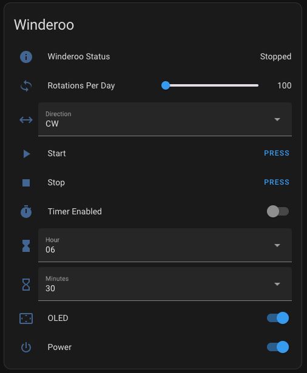

> [👈 Back to main page](../README.md)

# Software Installtion & Flashing your ESP32

> [!IMPORTANT]
> This project is an add-on to your already built [Open Source Watch Winder (OSWW)](https://github.com/mwood77/osww).

- This project requires a microncontroller which replaces the Pi Pico used in the OSWW.
- The Raspberry Pi Pico is incompatible with this project and must be swapped.


# Getting Started

### Prerequisites
- Download [Visual Studio Code (VSCode)](https://code.visualstudio.com/download)
- Download [PlatformIO](https://platformio.org/install/ide?install=vscode)

## Flashing your microcontroller

1. Download this repository. You can do this via git or by downloading the repository as a ZIP.
    - If you downloaded the repository as a zip, uzip it before proceeding to step 2.
    <div align="center"></div>
1. Open the extracted folder (or cloned repository if using git) in Visual Studio Code
1. **Build Options - (PWM, OLED, Home Assistant)**
    -  if you're building Winderoo with an OLED screen, intend to use Home Assistant, or you desire fine-grained motor control (pulse width modulation), you must enable some of the following build flags to tell PlatformIO to include additional libraries.
    - To toggle these build flags, navigate to the file called `platformio.ini`:
            <div align="center"></div>
        - In this file, you'll see the following block of code:
            ```yml
            build_flags =
                -D OLED_ENABLED=false
                -D PWM_MOTOR_CONTROL=false
                -D HOME_ASSISTANT_ENABLED=false
            ```
            - Change `-D HOME_ASSISTANT_ENABLED=false` to `-D HOME_ASSISTANT_ENABLED=true` to enable Winderoo's Home Assistant integration
            
            > ![CAUTION]
            > I'd strongly recommend you have a dedicated MQTT user; do not use your main account.

                - If this feature is enabled, you must add your Home Assistant's IP, username, and password.
                    - You can add them in [`main.cpp`](https://github.com/mwood77/winderoo/blob/b2d59a803a1c96bf578acefc24e2de71b626fc6e/src/platformio/osww-server/src/main.cpp#L51-L54) inside the configuration block:
                        ```cpp
                        // Home Assistant Configuration
                        const char* HOME_ASSISTANT_BROKER_IP = "YOUR_HOME_ASSISTANT_IP";
                        const char* HOME_ASSISTANT_USERNAME = "REPLACE_THIS_WITH_HOME_ASSISTANT_LOGIN_USERNAME";
                        const char* HOME_ASSISTANT_PASSWORD = "REPLACE_THIS_WITH_HOME_ASSISTANT_LOGIN_PASSWORD";
                        ```
            - Change `-D OLED_ENABLED=false` to `-D OLED_ENABLED=true` to enable OLED screen support
            - Change `-D PWM_MOTOR_CONTROL=false` to `-D PWM_MOTOR_CONTROL=true` to enable PWM motor control; at the time of writing, Winderoo with PWM only supports `MX1508` derived motor controllers.
                - > PWM_MOTOR_CONTROL is an experimental flag. You will encounter incorrect cycle time estimation and other possible bugs unless you align the motor speed to **20 RPM** (see [Troubleshooting](#troubleshooting)). Use at your own risk.
    - PlatformIO will now compile Winderoo with OLED screen and or PWM motor support
1. Select 'PlatformIO' (alien/insect looking button) on the workspace menu and wait for visual studio code to finish initializing the project
    <div align="center"></div>
1. Expand the main heading: **"esp32doit-devkit-v1"**:
    <div align="center"></div>
1. Expand the "General" heading, then click **Upload**. You'll see a message if the code was uploaded successfully:
    <div align="center"></div>
1. Now expand the "Platform" heading, then click **Upload Filesystem Image**. You'll see a message if the code was uploaded successfully:
    <div align="center"></div>
1. All done! Your microcontroller should now have 2 LEDs illuminated (see beneath). If it does, proceed to [Next steps](#next-steps). If not, try to upload the code & file system again.
    <div align="center"></div>
1. If you have a different LED state, compare it with this table:
    - [Understanding Winderoo's LED Blink Status](user-manual.md#understanding-winderoos-led-blink-status)

## Next steps

Ok, you've got 2 LEDs illuminated on your board. Great! Let's make sure the code works.

1. Get out your mobile device (phone/tablet) and navigate to the Wi-Fi / wireless network list. You'll want to find and join a WiFi network called "**Winderoo Setup**."
    - It may take a minute or so to connect, or look like it isn't doing anything. Hold tight, it is.
1. Once you've connected to "**Winderoo Setup**", a captive page will open called "WifiManger Winderoo Setup."
1. Tap "Configure WiFi"
1. Tap on the network you want to add Winderoo to, this is likely your home WiFi network
1. Enter your WiFi network's password then tap "Save." Wait until the captive page closes itself.
1. Re-join your home WiFi network
1. Open up a web browser and try to navigate to the following webpage:
    - [http://winderoo.local/](http://winderoo.local/)
1. If you see Winderoo's user interface, you're all done!
    - [Here is an overview of Winderoo's user interface](./user-manual.md)

### Home Assistant
If you've enabled Winderoo's Home Assistant integration, Winderoo will stream a number of entities into Home Assistant over MQTT. If you're unsure what MQTT or need to set this up in Home Assistant, [please see this document](https://www.home-assistant.io/integrations/mqtt).

Winderoo should be automatically discovered by Home Assistant within 60 seconds. The following entities are available to Home Assistant:
```yml
 -  button.winderoo_start
 -  button.winderoo_stop

 -  sensor.winderoo_status            : "Winding | Stopped"
 -  sensor.winderoo_wifi_reception    : "Excellent | Good | Fair | Poor"
 
 -  number.winderoo_rotations_per_day : 100 <-> 960 

 -  select.winderoo_direction         : "CCW | BOTH | CW"
 -  select.winderoo_hour              : 00 <-> 23
 -  select.winderoo_minutes           : 00 <-> 50
 
 -  switch.winderoo_timer_enabled     : "true | false"
 -  switch.winderoo_oled              : "true | false"
 -  switch.winderoo_power             : "true | false"
```

You can replicate Winderoo's GUI with a basic Home Assistant card:
<table align="center">
  <tr>
    <th>Home Assistant GUI</th>
    <th>Code</th>
  </tr>
  <tr>
    <td>
        
    </td>
    <td>
<pre><code>
type: entities
entities:
- entity: sensor.winderoo_status
- entity: number.winderoo_rotations_per_day
    name: Rotations Per Day
- entity: select.winderoo_direction
    name: Direction
- entity: button.winderoo_start
    name: Start
- entity: button.winderoo_stop
    name: Stop
- entity: switch.winderoo_timer_enabled
    name: Timer Enabled
- entity: select.winderoo_hour
    name: Hour
- entity: select.winderoo_minutes
    name: Minutes
- entity: switch.winderoo_oled
    name: OLED
- entity: switch.winderoo_power
    name: Power
title: Winderoo
show_header_toggle: false
</pre></code>
    </td>
  </tr>
</table>

## Troubleshooting
### Motor Turns too fast when using PWM
> [!WARNING]
> PWM_MOTOR_CONTROL is an experimental flag. You will encounter incorrect cycle time estimation and other possible bugs unless you align the motor speed to **20 RPM**.

- The default speed is `145` (8-bit resolution), where `0` is the slowest and `255` is the fastest. You can modify this value here:
    - [`MotorControl.cpp`](../src/platformio/osww-server/src/utils/MotorControl.cpp#L7)
        - Change the value for the variable `motorSpeed` to any value between `0` and `255`
        - After changing that value, you must recompile the software and upload it to your ESP32
- You can also tweak the rotational timing value. By default this is set at 8 seconds to complete one revolution.
    - To change this value, change the variable `durationInSecondsToCompleteOneRevolution` here:
    -  [`main.cpp`](../src/platformio/osww-server/src/main.cpp#L38)
