# User Manual

## Winderoo's User Interface

| v1.0.0 | |
| :---: |:---: |
|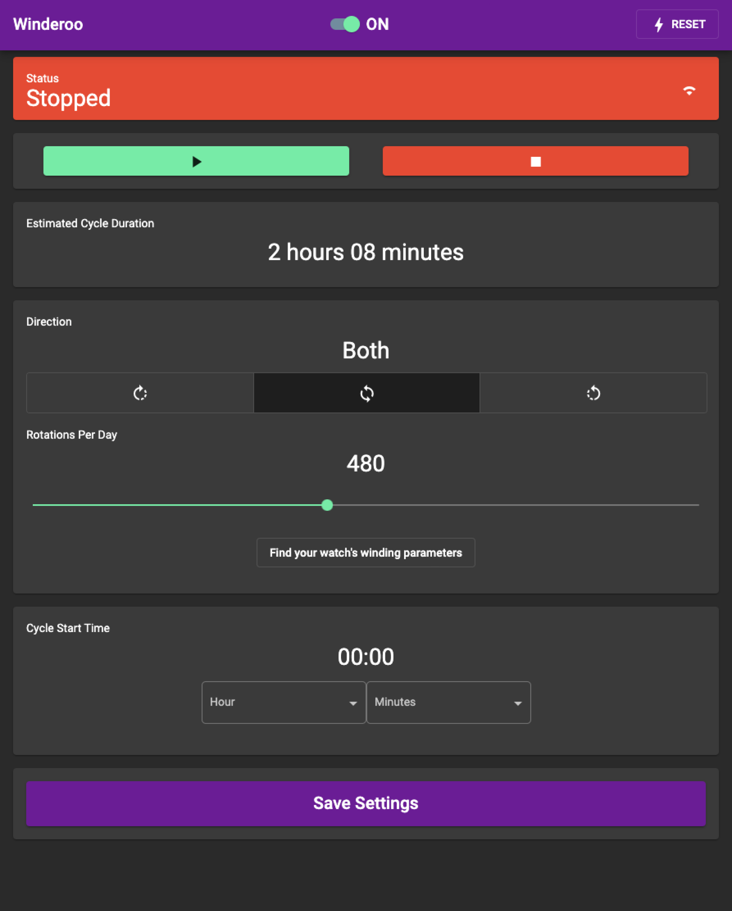  | This is winderoo's primary interace. From here you'll be able to change any settings you need. What follows is a break-down of what each feature does |

### Enable / Disable Winding
| UI Element | Function |
| :---: |:---: |
|  | This is a software switch, which will _completely enable or disable_ the winder's ability to wind. When the switch is set to **OFF**, Winderoo will not wind or begin winding at a your desired 'Cycle Start Time.' If you choose to attach an (optional) physical button, the code will automatically toggle this switch when you press the button. |

### Reset / Change WiFi Network
| UI Element | Function |
| :---: |:---: |
|  | This is will open a pop-up window, which will ask you to confirm reset, and walk you through the reset proceedure. Use this to change the WiFi network Winderoo connects to. |

### Status Bar
| UI Element | Function |
| :---: |:---: |
|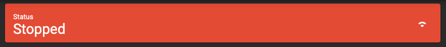  | Winder is not winding |
|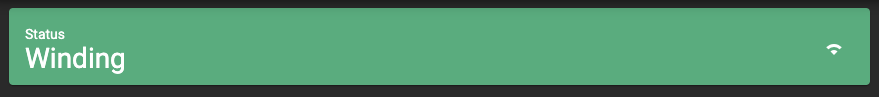  | Winder is winding |
| | Wifi Status - this behaves as you'd expect |

### Control Buttons
| UI Element | Function |
| :---: |:---: |
|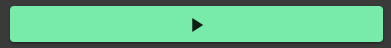  | _begin_ winding immediately, using saved settings |
|  | _stop_ winding immediately |

### Progress Indicator
> The progress indicator only appears while actively winding

| UI Element | Function |
| :---: |:---: |
|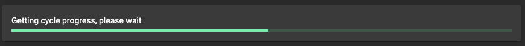  | While animated, Winderoo's is attempting to update the progress indicator |
|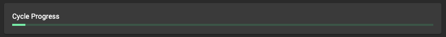  | The progress of the current winding routine |

### Estimated Cycle Duration
| UI Element | Function |
| :---: |:---: |
|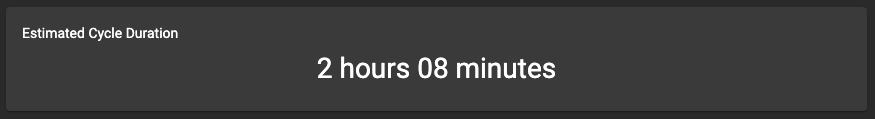  | An estimation of how long the your current winding routine will take, start to finish |

### Winder Control
| UI Element | Function |
| :---: |:---: |
|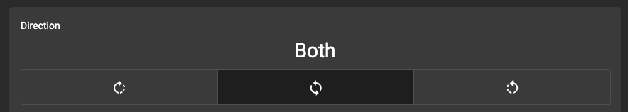  | Which direction Winderoo should turn. The available options are 'Clockwise,' 'Both' (clockwise + counter-clockwise), and 'Counter-Clockwise' |
|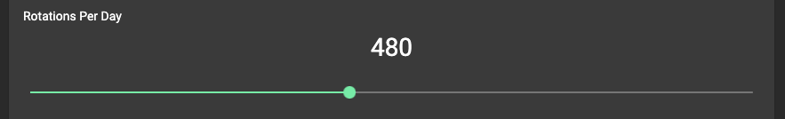  | How many full rotations Winderoo should complete per routine |
|  | Launches a new browser tab to an external, 3rd party website. This resource hosts winding parameters for most major watch manufacturers |

### Cycle Start Time
| UI Element | Function |
| :---: |:---: |
|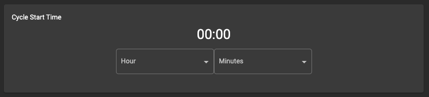  | Set which time you'd like Winderoo to begin winding at. **_Important!_** WInderoo will _always_ start at this time, even if you've already triggered a manual run with a [control button](#control-buttons). To stop this behaviour, see: [Enable / Disable Winding](#enable--disable-winding) |

### Save / Update Settings
| UI Element | Function |
| :---: |:---: |
|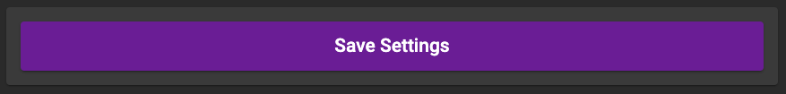  | This will capture and save all settings (winding direction, rotations per day, cycle start time). If a winding routine is currenty running, it does not reset the current routine (it will update and finish accordingly). If your wish to make sure the routine is changed, manually stop, then start the routine. See [control button](#control-buttons). |

## Understanding Winderoo's LED Blink Status

- Most ESP32 dev boards have a primary RED LED that is always on. This is typically a RED led. This cannot be shut off via firmware. 
    - If it bothers your, you can cover it with electrical tape, de-solder it, or scratch the trace with an exacto knife.
- Most ESP32 dev boards have a secondary BLUE LED, however some may be a different colour. Please use the 'blinking' status to decipher what Winderoo is trying to tell you.

| ESP32 Board (or optional external LED) | LED State | Meaning |
| :------------: | :------------: | :----------------------------------: |
|   | secondary LED is not illuminated | Winderoo is operational. |
|   | secondary LED is illuminated  | Winderoo's is ready for setup. Connect to the WiFi network called "Winderoo Setup" and add Winderoo to your WiFi network. |
| 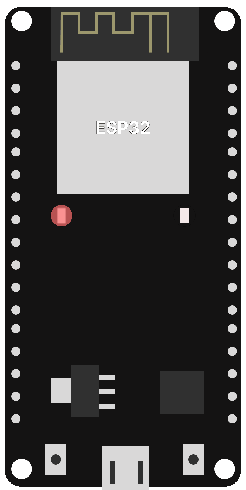   | slow blinking | Winderoo has successfully connected to your WiFi network. When the the **BLUE LED** stops blinking, you may access Winderoo's UI from your web browser. |
|  | fast blinking | Winderoo is resetting, wait until the **BLUE LED** turns solid to begin WiFi setup. |
|   | extremely slow blinking | Winderoo's winding capabilities have been turned 'OFF' via the software swtich, or an optional physical button. Winderoo will not wind until it has been turned to 'ON.' |