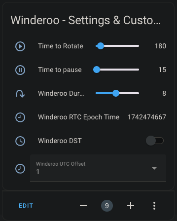

> [👈 Back to main page](../README.md)

# User Manual

#### Contents
- [Winderoo's Web User Interface](#winderoos-web-user-interface)
- [Winderoo's Home Assistant Interface](#winderoos-home-assistant-interface)
- [Winderoo's LED Blink Status](#winderoos-led-blink-status)

## Winderoo's Web User Interface

| v1.1.0 | |
| :---: |:---: |
|  | This is winderoo's primary interface. From here you can change any settings you need |


### Enable / Disable Winding
| UI Element | Function |
| :---: |:---: |
|  | This is a software switch, which will _completely enable or disable_ the winder's ability to wind. When the switch is set to **OFF**, Winderoo will not wind or begin winding at a your desired 'Cycle Start Time.' If you choose to attach an (optional) physical button, the code will automatically toggle this switch when you press the button. |

### Reset / Change WiFi Network
| UI Element | Function |
| :---: |:---: |
|  | This is will open a pop-up window, which will ask you to confirm reset, and walk you through the reset procedure. Use this to change the WiFi network Winderoo connects to. |
|  | This will open a pop-up menu where you can select which language you'd prefer. |

### Status Bar
| UI Element | Function |
| :---: |:---: |
|  | Winder is not winding |
|  | Winder is winding |
| | Wifi Status - this behaves as you'd expect |

### Control Buttons
| UI Element | Function |
| :---: |:---: |
|  | _begin_ winding immediately, using saved settings |
|  | _stop_ winding immediately |

### Progress Indicator
> The progress indicator only appears while actively winding

| UI Element | Function |
| :---: |:---: |
|  | While animated, Winderoo is attempting to update the progress indicator |
|  | The progress of the current winding routine |

### Estimated Cycle Duration
| UI Element | Function |
| :---: |:---: |
|  | An estimation of how long the your current winding routine will take, start to finish |

### Winder Control
| UI Element | Function |
| :---: |:---: |
|  | Which direction Winderoo should turn. The available options are 'Clockwise,' 'Both' (clockwise + counter-clockwise), and 'Counter-Clockwise' |
|  | How many full rotations Winderoo should complete per routine |
|  | Launches a new browser tab to an external, 3rd party website. This resource hosts winding parameters for most major watch manufacturers |

### Cycle Start Time
| UI Element | Function |
| :---: |:---: |
|  | This will enable or disable the winder's timer. When the switch is set to **ENABLED**, Winderoo will begin winding at a your desired 'Cycle Start Time.' If the switch is set to **DISABLED**, you must start the winder using the [control buttons](#control-buttons) |
|  | Set which time you'd like Winderoo to begin winding at. **_Important!_** Winderoo will _always_ start at this time, even if you've already triggered a manual run with a [control button](#control-buttons). To stop this behavior, see: [Enable / Disable Winding](#enable--disable-winding) |

### OLED Screen

>[!IMPORTANT]
> This element will appear _only if_ you've compiled Winderoo with an OLED screen attached, and set the build flag accordingly.

| UI Element | Function |
| :---: |:---: |
|  | This will toggle the attached OLED screen on and off. |


### Settings & Customization

| UI Element | Function |
| :---: |:---: |
|   | This sets the amount of time to rotate between pauses. Default is `3 minutes` |
|    | This sets the amount of time to pause between rotation cycles. Default is `15 seconds` |
|  | This sets the amount of time it takes the winder to complete one full rotation. This value should only be changed if you've used a different motor, different gearing, or have retrofitted Winderoo into a off-the-shelf winder |
|              | This reflects Winderoo's real time clock (RTC). This is set automatically using an NTP Pool. By default Winderoo's UTC offset is set to `0`. For accurate timekeeping, you must set this offset to your current location. You can use a site like [timeanddate.com](https://www.timeanddate.com/time/zone/timezone/utc) to search for your city and find your UTC offset. |


### Save / Update Settings
| UI Element | Function |
| :---: |:---: |
|  | This will capture and save all settings (including customizations). If a winding routine is currently running, it does not reset the current routine (it will update and finish accordingly). If you wish to make sure the routine is changed, manually stop, then start the routine. See [control buttons](#control-buttons). |


## Winderoo's Home Assistant Interface

>[!IMPORTANT]
> Home Assistant entities will only appear you've compiled Winderoo with the `HOME_ASSISTANT_ENABLED` build flag set to `TRUE`. If you're unsure how to do this, see the "**Build Options**" step under "*Flashing your microcontroller*" heading on the [Install Software](./install-software.md) documentation page.

If you've enabled Winderoo's Home Assistant integration, Winderoo will stream a number of entities into Home Assistant over MQTT. If you're unsure what MQTT or need to set this up in Home Assistant, [please see this document](https://www.home-assistant.io/integrations/mqtt).

Winderoo should be automatically discovered by Home Assistant within 60 seconds. The following entities are available to Home Assistant:
```yml
 -  button.winderoo_start
 -  button.winderoo_stop

 -  sensor.winderoo_status                                    : "Winding | Stopped"
 -  sensor.winderoo_wifi_reception                            : "Excellent | Good | Fair | Poor"
 -  sensor.winderoo_rtc_epoch_time                            : <unix epoch>
 
 -  number.winderoo_rotations_per_day                         : 100 <-> 960 
 -  number.winderoo_time_to_rotate                            : 100 <-> 960 
 -  number.winderoo_time_to_pause                             : 10 <-> 900 
 -  number.winderoo_duration_to_complete_a_single_rotation    : 1 <-> 16 

 -  select.winderoo_direction                                 : "CCW | BOTH | CW"
 -  select.winderoo_hour                                      : 00 <-> 23
 -  select.winderoo_minutes                                   : 00 <-> 50
 -  select.winderoo_rtc_hour                                  : 00 <-> 23
 -  select.winderoo_rtc_minutes                               : 00 <-> 59
 
 -  switch.winderoo_timer_enabled                             : "true | false"
 -  switch.winderoo_oled                                      : "true | false"
 -  switch.winderoo_power                                     : "true | false"
```

You can replicate Winderoo's GUI with a basic Home Assistant card:
<table align="center">
  <tr>
    <th>Home Assistant GUI</th>
    <th>Code</th>
  </tr>
  <tr>
    <td>
        
    </td>
    <td>
<pre><code>
type: entities
entities:
- entity: sensor.winderoo_status
- entity: number.winderoo_rotations_per_day
    name: Rotations Per Day
- entity: select.winderoo_direction
    name: Direction
- entity: button.winderoo_start
    name: Start
- entity: button.winderoo_stop
    name: Stop
- entity: switch.winderoo_timer_enabled
    name: Timer Enabled
- entity: select.winderoo_hour
    name: Hour
- entity: select.winderoo_minutes
    name: Minutes
- entity: switch.winderoo_oled
    name: OLED
- entity: switch.winderoo_power
    name: Power
title: Winderoo
show_header_toggle: false
</pre></code>
    </td>
  </tr>
  <tr>
    <td>
        
    </td>
    <td>
<pre><code>
type: entities
entities:
  - entity: number.winderoo_time_to_rotate
    name: Time to Rotate
  - entity: number.winderoo_time_to_pause
    name: Time to pause
  - entity: number.winderoo_duration_to_complete_a_single_rotation
  - entity: select.winderoo_rtc_hour
    name: RTC Hour
  - entity: select.winderoo_rtc_minutes
    name: RTC Minutes
  - entity: sensor.winderoo_rtc_epoch_time
title: Winderoo - Settings & Customization
</pre></code>
    </td>
  </tr>
</table>


## Winderoo's LED Blink Status

- Most ESP32 dev boards have a primary RED LED that is always on. This cannot be shut off via firmware. 
    - If you find it bothersome, you can cover it with electrical tape, de-solder it, or cut the trace with an x-acto knife.

- Most ESP32 dev boards have a secondary BLUE LED, however some may be a different colour. 
    - Please use the following table to understand what Winderoo is telling you.


| ESP32 Board (or optional external LED) | LED State | Meaning |
| :------------: | :------------: | :----------------------------------: |
|   | secondary LED is not illuminated | Winderoo is operational. |
|   | secondary LED is illuminated  | Winderoo is ready for setup. Connect to the WiFi network called "Winderoo Setup" and add Winderoo to your WiFi network. |
|    | slow blinking | Winderoo has successfully connected to your WiFi network. When the the **BLUE LED** stops blinking, you may access Winderoo's UI from your web browser. |
|  | fast blinking | Winderoo is resetting, wait until the **BLUE LED** turns solid to begin WiFi setup. |
|   | extremely slow blinking | Winderoo's winding capabilities have been turned 'OFF' via the software switch, or an optional physical button. Winderoo will not wind until it has been turned to 'ON.' |