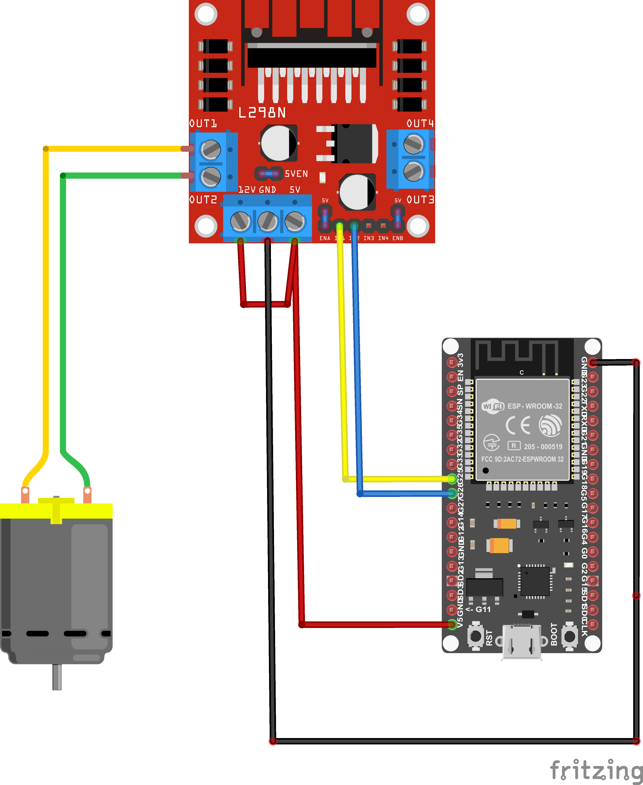
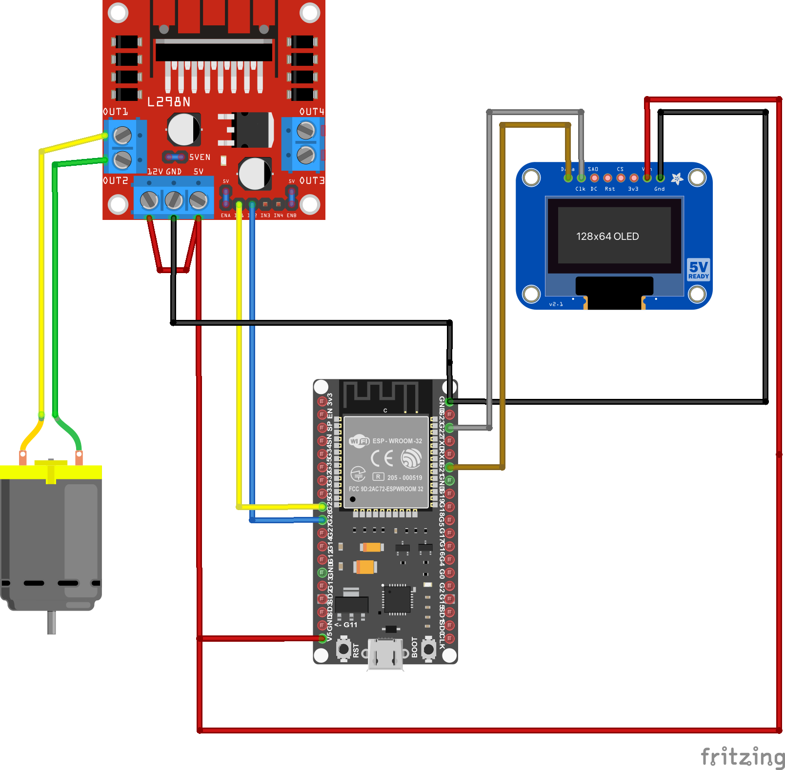

> [👈 Back to main page](../README.md)

# Wiring Diagrams - Winderoo
- [Winderoo](#winderoo)
- [Winderoo With OLED Screen](#winderoo-with-oled-screen)

## Winderoo

    <a href="./winderoo-wiring-diagram-fritzing.pdf">Is the image hard to view? Open the PDF instead</a>

 

- Connect the ESP32's `5V` Output pin to the 5V input of the L298N driver board (red wire)
- Connect a ground from the ESP32 to the L298N driver board (black wire)
- Connect the L298N driver board's 5V and 12V terminals together (red jumper wire)
- Make sure the L298N's jumpers are in place (small blue wires on board)
- Connect the ESP32's `GPIO25` to `IN1` on the L298N driver board (yellow wire)
- Connect the ESP32's `GPIO26` to `IN2` on the L298N driver board (blue wire)
- Connect the DC motor to channel 1 on the L298N driver board.
    - > Note: polarity does not matter here
    - You may add an external button off `GPIO 13` on the ESP32; this will enable and disable winding

## Winderoo with OLED Screen

> [!IMPORTANT]
> This wiring diagram assumes you've purchased an I2C 4-wire OLED (SSD1306 driver compatible). Complex LCDs are currently not supported.

<!-- @todo - update diagram -->

    <a href="./winderoo-with-oled-wiring-diagram.pdf">Is the image hard to view? Open the PDF instead</a>

 

- Connect the ESP32's `5V` output pin to the 5V input of the L298N driver board (red wire)
- Connect the ESP32's `5V` output pin to the `VCC` input pin on your OLED screen
- Connect a ground wire from the ESP32 to the L298N driver board (black wire)
- Connect a ground wire from the ESP32 to the OLED screen's `GRND` pin
- Connect a wire from the ESP32's `D22` pin to the OLED screen's `SCL` pin
- Connect a wire from the ESP32's `D21` pin to the OLED screen's `SDA` pin
- Connect the L298N driver board's 5V and 12V terminals together (red jumper wire)
- Make sure the L298N's jumpers are in place (small blue wires on board)
- Connect the ESP32's `GPIO25` to `IN1` on the L298N driver board (yellow wire)
- Connect the ESP32's `GPIO26` to `IN2` on the L298N driver board (blue wire)
- Connect the DC motor to channel 1 on the L298N driver board.
    - > Note: polarity does not matter here
    - You may add an external button off `GPIO 13` on the ESP32; this will enable and disable winding